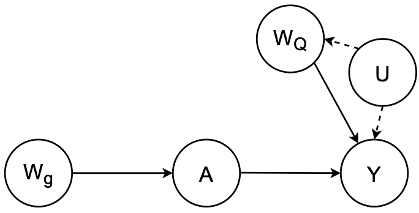

```{r, include = FALSE}
knitr::opts_chunk$set(
  eval = FALSE,
  collapse = TRUE,
  comment = "#>"
)
```

This document stores the codes for simulation and estimation of the paper: 
```
@unpublished{zhong_aipw_2021,
  author = "Zhong, Y., Kennedy, E.H., Bodnar, L.M., Naimi, A.I. ",
  title = "AIPW: An R package for Augmented Inverse Probability Weighted Estimation of Average Causal Effects",
  year = {\ndd},
  note = "under review",
  journal = "American Journal of Epidemiology"
}
```
Contents:

  * [Data generating mechanisms](#DGM)
    + [Setup](#setup)
    + [RCT simulation](#sim_rct)
    + [Observational study simulation](#sim_obs)
  * [ATE Estimation in RCT (Table 2)](#table2)
  * [Package Performance Evaluation (Table 3)](#table3)
    + [True model](#glm)
    + [GAMs + no cross-fitting](#gams)
    + [GAMs + k=10 cross-fitting](#gams_cv)
    + [SuperLearner + no cross-fitting](#sl)
    + [SuperLearner + k=10 cross-fitting](#sl_cv)
  * [Package Performance Evaluation for log(RR) and log(OR) (Table S1)](#tables1)
  
## <a id="DGM"></a>Data generating mechanisms 

### <a id="setup"></a>Setup

<div style="text-align: right"> <a href="#top">Back to top</a> </div>

```{r sim_setup}
packages <- c("tidyverse","here")

for (package in packages) {
  if (!require(package, character.only=T, quietly=T)) {
    install.packages(package,repos='http://lib.stat.cmu.edu/R/CRAN')
  }
}
#-------------------Setup-------------------#
set.seed(123)
#load EAGeR baseline Data
eager_bl

#----------------Simulations----------------#
start_time = Sys.time()
oracle_n = 1e6

n = 200
nSim = 2000
nSim_vec = rep(n,nSim)
#--------------Helper functions-------------#
#' @title Expit function
#' @param x a non-zero value
expit <- function(x) exp(x)/(exp(x)+1)
#' @title Plasmode simulation function for binary variable
#'
#' @param model_coef model coefficients
#' @param data data used for the model
#'
#' @return a list with simulated data with pertaining information
plasmode <- function(model_coef,data){
  #get prop
  prop <- expit(as.matrix(cbind(1,data)) %*% matrix(model_coef,ncol=1))
  #get sim
  sim <- rbinom(nrow(data),1,prop)
  return(list(coef=model_coef, df_col=colnames(data) ,prop=as.numeric(prop),simBin = sim))
}
```

### <a id="sim_rct"></a>Simulated randomized trial 
{width=50%}

<div style="text-align: right"> <a href="#top">Back to top</a> </div>

```{r sim_rct}
#outcome model
true_mod_Y <- glm(live_birth ~ ., data=eager_bl %>% select(-eligibility), family='binomial')
summary(true_mod_Y)
out_coef <- coef(true_mod_Y)
out_coef[2] = log(1.75)
round(out_coef,2)

# function for simulation
#' @title Using `plasmode` function to simulate a plasmode dataframe
#' @param boot_n sample size
#' @param out_coef a vector of coefficients for the outcome model
plasmode_rct_df <- function(boot_n,out_coef){
  eager_boot_id <- sample(1:nrow(eager_bl),size = boot_n,replace = T)
  eager_boot <- eager_bl[eager_boot_id,]

  #nodes
  Y <- eager_boot$live_birth
  A <- eager_boot$treatment
  W.g <- eager_boot$eligibility #propensity
  W.Q <- eager_boot %>% dplyr::select(loss_num,age,time_try_pregnant,BMI,meanAP) #outcome

  ####exposure model (depends on eligibility criteria)
  prob_A <- if_else(eager_boot$eligibility==1, 0.75, 0.25)
  sim_A <- rbinom(n = boot_n, size = 1, prob_A)
  attr(sim_A,"marginal_prop") <- mean(sim_A)

  ####outcome model
  sim_QW <-  plasmode(out_coef,cbind(sim_A,W.Q))
  sim_Y <- sim_QW$simBin
  attr(sim_Y,"marginal_prop") <- mean(sim_QW$prop)

  eager_sim <- data.frame(sim_A,sim_Y,eligibility = W.g,W.Q)
  attr(eager_sim,"random.state") <- .Random.seed
  return(eager_sim)
}
#----true----#
big_dat <- plasmode_rct_df(boot_n = oracle_n, out_coef)
#ps
mod_true_A <- glm(sim_A ~ ., data=big_dat[,-2], family=binomial("logit"))
summary(mod_true_A)
exp(coef(mod_true_A))
#outcome
mod_true <- glm(sim_Y ~ ., data=big_dat, family=binomial("logit"))
summary(mod_true)
exp(coef(mod_true))

mu1 <- mean(predict(mod_true,newdata=transform(big_dat,sim_A=1),type="response"))
mu0 <- mean(predict(mod_true,newdata=transform(big_dat,sim_A=0),type="response"))
gc()

#save for data(eager_sim_rct)
eager_sim_rct <- plasmode_rct_df(boot_n = oracle_n, out_coef)
```


### <a id="sim_obs"></a>Simulated observational study
{width=50%}

<div style="text-align: right"> <a href="#top">Back to top</a> </div>

```{r sim_obs}
#exposure model
true_mod_A <- glm(treatment ~ ., data=eager_bl[,-1], family='binomial')
ps_coef <- coef(true_mod_A)
ps_coef[2] = log(1.75)
ps_coef[4] = log(1.01)
ps_coef[6] = log(0.98)
round(ps_coef,2)

#outcome model
true_mod_Y <- glm(live_birth ~ ., data=eager_bl, family='binomial')
summary(true_mod_Y)
out_coef <- coef(true_mod_Y)
out_coef[2] = log(1.75)
out_coef[7] = log(0.95)
round(out_coef,2)

#function for simulation
#' @title Using `plasmode` function to simulate a plasmode dataframe
#' @param boot_n sample size
#' @param ps_coef a vector of coefficients for the exposure model
#' @param out_coef a vector of coefficients for the outcome model
plasmode_obs_df <- function(boot_n, ps_coef,out_coef){
  eager_boot_id <- sample(1:nrow(eager_bl),size = boot_n,replace = T)
  eager_boot <- eager_bl[eager_boot_id,]
  W = eager_boot[,-1:-2]

  ####exposure model
  sim_gW <- plasmode(ps_coef,W)
  sim_A <- sim_gW$simBin
  attr(sim_A,"marginal_prop") <- mean(sim_gW$prop)

  ####outcome model
  sim_QW <- plasmode(out_coef,cbind(sim_A,W))
  sim_Y <- sim_QW$simBin
  attr(sim_Y,"marginal_prop") <- mean(sim_QW$prop)


  #combine together
  eager_sim <- data.frame(sim_A,sim_Y,W)
  attr(eager_sim,"random.state") <- .Random.seed
  return(eager_sim)
}

#----true----#
big_dat <- plasmode_obs_df(boot_n = oracle_n, ps_coef, out_coef)
#ps
mod_true_A <- glm(sim_A ~ ., data=big_dat[,-2], family=binomial("logit"))
summary(mod_true_A)
exp(coef(mod_true_A))
#outcome
mod_true <- glm(sim_Y ~ ., data=big_dat, family=binomial("logit"))
summary(mod_true)
exp(coef(mod_true))

mu1 <- mean(predict(mod_true,newdata=transform(big_dat,sim_A=1),type="response"))
mu0 <- mean(predict(mod_true,newdata=transform(big_dat,sim_A=0),type="response"))
gc()

#simulation
obs_df_list <- lapply(nSim_vec, function(x) plasmode_obs_df(boot_n=x, ps_coef, out_coef))
obs_df_list <- list(df_list = obs_df_list,
                    meta_info = list(W = colnames(eager_bl[,-1:-2]),
                                     A_marginal_prop = attr(big_dat$sim_A,"marginal_prop"),
                                     Y_marginal_prop = attr(big_dat$sim_Y,"marginal_prop"),
                                     true_rd =mu1-mu0,
                                     true_logrr = log(mu1)-log(mu0),
                                     true_logor = log((mu1/(1-mu1))/(mu0/(1-mu0)))
                                     )
)
# one of the simulated observational dataset was saved in data(eager_sim_obs)
```


## <a id="table2"></a>Estimating the average treatment effect in the simulated RCT 
Codes for Table 2.
<div style="text-align: right"> <a href="#top">Back to top</a> </div>


```{r table2}
#-----------setup-----------#
packages <- c("tidyverse","here","future.apply","progressr",
              "AIPW","npcausal","CausalGAM","SuperLearner","tmle",
              "tmle3","sl3", "knitr","kableExtra"
)
# remotes::install_github("yqzhong7/AIPW")
# remotes::install_github("tlverse/sl3")
# remotes::install_github("tlverse/tmle3")
# remotes::install_github("ehkennedy/npcausal")
for (package in packages) {
  if (!require(package, character.only=T, quietly=T)) {
    install.packages(package,repos='http://lib.stat.cmu.edu/R/CRAN')
  }
}

start_time <- Sys.time()
#---------example code----------#
library(AIPW)
library(SuperLearner)
set.seed(1234)
#load simulated dataset (RCT)
data(eager_sim_rct)
#Specify SuperLearner libraries
sl.lib = c("SL.gam","SL.earth","SL.ranger","SL.xgboost")
#Create a vector of covariates
Cov = c("loss_num","age", "time_try_pregnant","BMI","meanAP")
#create a new AIPW object called AIPW_SL
AIPW_SL <- AIPW$new(Y = eager_sim_rct$sim_Y,
                    A = eager_sim_rct$sim_T,
                    W.g = eager_sim_rct$eligibility,
                    W.Q = subset(eager_sim_rct,select=Cov), #covariates
                    Q.SL.library = sl.lib, #outcome model
                    g.SL.library = sl.lib, #exposure model
                    k_split = 10, #num of folds for cross-fitting
                    verbose=TRUE)
#fit the data stored in the AIPW_SL object
AIPW_SL$fit()
#summarise the results using truncated propensity scores
AIPW_SL$summary(g.bound = 0.025)

(a_end_time <- Sys.time() - start_time)

#----------------npcausal-----------------#
start_time <- Sys.time()
np_ate <- npcausal::ate(y = eager_sim_rct$sim_Y,
                        a = eager_sim_rct$sim_T,
                        x = eager_sim_rct[,-1:-2],
                        nsplits = 10,
                        sl.lib = sl.lib,
                        ps = NULL)
np_ate$res[3,2:5]
(n_end_time <- Sys.time() - start_time)

#----------------causalGAM-----------------#
start_time <- Sys.time()
pscore.formula <- as.formula("sim_T ~ eligibility")
outcome.formula <- as.formula("sim_Y ~ sim_T + loss_num + s(age) + s(time_try_pregnant) + s(BMI) + 
                              s(meanAP)")

cgam_fit <- estimate.ATE(
  pscore.formula = pscore.formula,
  outcome.formula.t = outcome.formula,
  outcome.formula.c = outcome.formula,
  treatment.var = "sim_T",
  outcome.family = binomial,
  pscore.family = binomial,
  divby0.action = "truncate",
  divby0.tol = 0.025,
  data=as.data.frame(eager_sim_rct),
  nboot=2000,
  var.gam.plot = FALSE
)

(c_end_time <- Sys.time() - start_time)


#-----------------tmle-----------------#
start_time <- Sys.time()
tmle_fit <- tmle(
  A = eager_sim_rct$sim_T,
  Y = eager_sim_rct$sim_Y,
  W = eager_sim_rct[,-1:-2],
  g.SL.library = sl.lib,
  Q.SL.library = sl.lib,
  family = "binomial",
  cvQinit = T,
  gbound = 0.025,
  V = 10,
  automate = FALSE)
(t0_end_time <- Sys.time() - start_time)

#---------------tmle3--------------------#
#sl3(not-tuned)
lrnr_gam <- Lrnr_pkg_SuperLearner$new("SL.gam")
lrnr_earth <- make_learner(Lrnr_earth)
lrnr_ranger <- make_learner(Lrnr_ranger, seed=123)
lrnr_xgboost <- make_learner(Lrnr_xgboost, seed=123)
# stacked
learner_stack <- Stack$new(lrnr_gam, lrnr_earth, lrnr_ranger, lrnr_xgboost)
# Metalearner
metalearner <- make_learner(Lrnr_nnls)
sl3.lib <- Lrnr_sl$new(learners = learner_stack, metalearner = metalearner)
start_time <- Sys.time()

#tmle3 task
node_list <- list(
  W = colnames(eager_sim_rct[,-1:-2]),
  A = "sim_T",
  Y = "sim_Y"
)

ate_spec <- tmle_ATE(
  treatment_level = 1,
  control_level = 0
)
or_spec <- tmle_OR(
  contrast_level  = 1,
  baseline_level =  0
)
rr_spec <- tmle_RR(
  contrast_level =  1,
  baseline_level = 0
)
learner_list <- list(A = sl3.lib, Y = sl3.lib)

tmle3_fit_ate <- tmle3(ate_spec, eager_sim_rct, node_list, learner_list)
tmle3_fit_or <- tmle3(or_spec, eager_sim_rct, node_list, learner_list)
tmle3_fit_rr <- tmle3(rr_spec, eager_sim_rct, node_list, learner_list)
(t3_end_time <- Sys.time() - start_time)


#--------------output---------------#
#true
true_est <- matrix(c(attributes(eager_sim_rct)$true_rd,
                     exp(attributes(eager_sim_rct)$true_logrr),
                     exp(attributes(eager_sim_rct)$true_logor), rep(NA,9)),
                     nrow = 3, byrow = FALSE)

# AIPW
aipw_sl$result[,1:4]

#npcausal
npcausal_est <- rbind(as.numeric(np_ate$res[3,2:5]), rep(NA,4),rep(NA,4))

# CausalGAM
causalgam_rd = c(cgam_fit$ATE.AIPW.hat, cgam_fit$ATE.AIPW.asymp.SE,
                  cgam_fit$ATE.AIPW.hat -1.96*cgam_fit$ATE.AIPW.asymp.SE,
                  cgam_fit$ATE.AIPW.hat + 1.96*cgam_fit$ATE.AIPW.asymp.SE)
causalgam_est <- rbind(causalgam_rd, rep(NA,4),rep(NA,4))
#tmle
tmle_est <- rbind(
  unlist(tmle_fit$estimates$ATE)[1:4],
  unlist(tmle_fit$estimates$RR)[c(1,6,2:3)],
  unlist(tmle_fit$estimates$OR)[c(1,6,2:3)]
)
tmle_est[,2] <- sqrt(tmle_est[,2])
#tmle3
tmle3_est <- rbind(
  tmle3_fit_ate$summary,
  tmle3_fit_rr$summary[3,],
  tmle3_fit_or$summary[3,]
) %>% select(psi_transformed, se, lower_transformed, upper_transformed)

#combine all together
pkgnames <- c("True Est.","AIPW","CausalGAM","npcausal","tmle","tmle3")
eager_est <- rbind(
  true_est,
  AIPW_SL$result[,1:4],
  causalgam_est,
  as.matrix(npcausal_est),
  tmle_est,
  as.matrix(tmle3_est)
) %>%
  as.data.frame() %>%
  mutate(Estimand = rep(c("RD","RR","OR"),length(pkgnames)),
         pkg = unlist(lapply(pkgnames, function(x) rep(x,3)))) %>%
  pivot_wider(names_from = Estimand,
              values_from = 1:4) %>%
  as.data.frame() %>%
  select(pkg, ends_with("RD"), ends_with("RR"), ends_with("OR"))

#latex table
options(knitr.kable.NA = "-")
kable(eager_est, digits = 3, "latex", booktabs = T,
      col.names = c("Package",rep(c("Est.","SE","LCL","UCL"), 3)),
      caption = "Estimated average treatment effects of 
      a simulated randomized controlled trial based on EAGeR") %>%
  add_header_above(c(" " = 1 , "RD" = 4, "RR" = 4,"OR" = 4))
```


## <a id="table3"></a>Pacakge Performance Evaluation
Function specifications for Table 3. The following functions take obs_df_list as input and were set up for future.apply.
<div style="text-align: right"> <a href="#top">Back to top</a> </div>


### <a id="glm"></a>True model (GLM + no cross-fitting)
```{r}
packages <- c("future.apply","progressr","sandwich","boot",
              "AIPW","npcausal","CausalGAM","SuperLearner","tmle",
              "tmle3","sl3")

for (package in packages) {
  if (!require(package, character.only=T, quietly=T)) {
    install.packages(package,repos='http://lib.stat.cmu.edu/R/CRAN')
  }
}

set.seed(123)
#create a list for all global objects for future_lapply
fg.var <- ls(globalenv())
fg.list <- lapply(fg.var, function(x) get(x,globalenv()))
names(fg.list) <- fg.var

#----------gComp-----------#
gComp <- function(dataList,boot_n = 200){
  iter <- 1:length(dataList)
  pb <- progressr::progressor(along=iter)
  est <- future.apply::future_lapply(
    iter,
    future.seed = T,
    future.packages = packages,
    future.globals = fg.list,
    future.label = T,
    function(i, ...) {
      dat = dataList[[i]]
      start_time <- Sys.time()
      g <- function(data, j ){
        dat = data[j,]
        mod_true <- glm(sim_Y ~ sim_A + eligibility + loss_num + age + time_try_pregnant + BMI + meanAP, 
                        data=dat, family=binomial("logit"))
        mu1 <- mean(predict(mod_true,newdata=transform(dat,sim_A=1),type="response"))
        mu0 <- mean(predict(mod_true,newdata=transform(dat,sim_A=0),type="response"))
        output <- mu1 - mu0
        return(output)
      }
      g_boot <- boot(data=dat, statistic = g, R = boot_n)
      ci <- boot.ci(g_boot,index =1,type = "norm")

      output <- c(g_boot$t0, mean(g_boot$t), sd(g_boot$t), ci$normal[2:3])
      names(output) <- c("Model-based RD","Bootstrap RD", "Bootstrap SE", "Bootstrap LCL", "Bootstrap UCL")
      elapsed_time <- Sys.time() - start_time
      pb(message=sprintf("No.%g", i))
      return(c(output,elapsed_time))
    })
}
#---------IPW-----------#
ipw <- function(dataList){
  iter <- 1:length(dataList)
  pb <- progressr::progressor(along=iter)
  est <- future.apply::future_lapply(
    iter,
    future.seed = T,
    future.packages = packages,
    future.globals = fg.list,
    future.label = T,
    function(i, ...) {
      dat = dataList[[i]]
      start_time <- Sys.time()
      p_score <- glm(sim_A ~ eligibility + loss_num + age + time_try_pregnant + BMI + meanAP, 
                     data=dat, family=binomial("logit"))$fitted.values
      dat$ate_sw <- as.numeric( (mean(dat$sim_A))*(dat$sim_A/p_score) + 
                                  (mean(1-dat$sim_A))*((1-dat$sim_A)/(1-p_score)) )
      ipw <-glm(sim_Y ~ sim_A, weights = ate_sw,data=dat, family=binomial("identity"))
      ipw_est <- as.numeric(ipw$coefficients[2])
      ipw_se <- sqrt(vcovHC(ipw, type = "HC1")[2,2])
      ipw_lcl <- ipw_est - 1.96*ipw_se
      ipw_ucl <- ipw_est + 1.96*ipw_se
      elapsed_time <- Sys.time() - start_time
      pb(message=sprintf("No.%g", i))
      return(c(ipw_est,ipw_se,ipw_lcl,ipw_ucl,elapsed_time))
    })
}

#----------GLM + No cross-fitting------(AIPW, npcausal, CausalGAM, tmle, tmle3)
dr_glm <- function(dataList){
  iter <- 1:length(dataList)
  pb <- progressr::progressor(along=iter)
  est <- future.apply::future_lapply(
    iter,
    future.seed = T,
    future.packages = packages,
    future.globals = fg.list,
    future.label = T,
    function(i, ...) {
      dat = dataList[[i]]
      sl.lib = "SL.glm"
      #---AIPW---#
      s_time <- Sys.time()
      suppressMessages({
        aipw_fit <- AIPW$new(Y=dat$sim_Y,
                             A=dat$sim_A,
                             W=dat[,-1:-2],
                             g.SL.library = sl.lib,
                             Q.SL.library = sl.lib,
                             k_split = 1,
                             verbose = FALSE)$
          fit()$
          summary(g.bound=0.025)
      })
      aipw_est = aipw_fit$estimates$RD
      e_time <- Sys.time()
      aipw_time <- as.numeric(difftime(e_time, s_time, units='sec'))

      #---npcausal---#
      s_time <- Sys.time()
      suppressMessages({
        np_ate <- npcausal::ate(y = dat$sim_Y,
                              a = dat$sim_A,
                              x = dat[,-1:-2],
                              nsplits = 1,
                              sl.lib = sl.lib,
                              ps = NULL)
      })
      npcausal_est = as.numeric(np_ate$res[3,2:5])
      e_time <- Sys.time()
      npcausal_time <- as.numeric(difftime(e_time, s_time, units='sec'))

      #---CausalGAM--#
      #no splines
      s_time <- Sys.time()
      pscore.formula <- as.formula(paste0("sim_A ~ ",paste(obs_df_list$meta_info$W,collapse = "+")))
      outcome.formula <- as.formula(paste0("sim_Y ~ sim_A+",paste(obs_df_list$meta_info$W,collapse = "+")))

      cgam_fit <- estimate.ATE(
        pscore.formula = pscore.formula,
        outcome.formula.t = outcome.formula,
        outcome.formula.c = outcome.formula,
        treatment.var = "sim_A",
        outcome.family = binomial,
        pscore.family = binomial,
        divby0.action = "truncate",
        divby0.tol = 0.025,
        data=dat, nboot=0,
        var.gam.plot = FALSE
      )
      causalgam_est = c(cgam_fit$ATE.AIPW.hat, cgam_fit$ATE.AIPW.asymp.SE,
                        cgam_fit$ATE.AIPW.hat -1.96*cgam_fit$ATE.AIPW.asymp.SE,
                        cgam_fit$ATE.AIPW.hat + 1.96*cgam_fit$ATE.AIPW.asymp.SE)
      e_time <- Sys.time()
      causalGAM_time <- as.numeric(difftime(e_time, s_time, units='sec'))

      #---tmle---#
      s_time <- Sys.time()
      suppressMessages({
        tmle_fit <- tmle(Y=dat$sim_Y,
                         A=dat$sim_A,
                         W=dat[,-1:-2],
                         g.SL.library = sl.lib,
                         Q.SL.library = sl.lib,
                         family = "binomial",
                         cvQinit = F,
                         gbound = 0.025,
                         V = 10,
                         automate = FALSE)
      })
      tmle_est = unlist(tmle_fit$estimates$ATE)[1:4]
      tmle_est[2] = sqrt(tmle_est[2])
      e_time <- Sys.time()
      tmle_time <- as.numeric(difftime(e_time, s_time, units='sec'))

      #---tmle3---#
      sl3.lib = make_learner(Lrnr_glm)
      s_time <- Sys.time()
      learner_list <- list(A = sl3.lib, Y = sl3.lib)
      #task
      node_list <- list(
        W = obs_df_list$meta_info$W,
        A = "sim_A",
        Y = "sim_Y"
      )

      ate_spec <- tmle_ATE(
        treatment_level = 1,
        control_level = 0
      )
      tmle_task <- ate_spec$make_tmle_task(dat, node_list)
      #initial likelihood
      initial_likelihood <- ate_spec$make_initial_likelihood(tmle_task,learner_list)
      #targeted likelihood without cv
      targeted_likelihood <- Targeted_Likelihood$new(initial_likelihood,
                                                     updater = list(cvtmle = FALSE))
      tmle_params <- ate_spec$make_params(tmle_task, targeted_likelihood)
      #pulling together
      tmle3_fit <- fit_tmle3(tmle_task,
                             targeted_likelihood,
                             tmle_params,
                             targeted_likelihood$updater)
      tmle3_est = unlist(tmle3_fit$summary[,4:7])
      e_time <- Sys.time()
      tmle3_time <- as.numeric(difftime(e_time, s_time, units='sec'))
      #---output---#
      pb(message=sprintf("No.%g", i))
      output <- matrix(
        c(aipw_est, aipw_time,
          npcausal_est, npcausal_time,
          causalgam_est, causalGAM_time,
          tmle_est, tmle_time,
          tmle3_est, tmle3_time),
        nrow = 5,byrow = TRUE,
        dimnames = list(c("AIPW","npcausal","causalGAM","tmle","tmle3"),
                        c(names(aipw_est),"elapsed_time_sec"))
      )
      return(output)
    })
}

```

### <a id="gams"></a>GAMs + no cross-fitting (AIPW, CausalGAM, npcausal, tmle, tmle3)
<div style="text-align: right"> <a href="#top">Back to top</a> </div>
```{r}
dr_gam <- function(dataList){
  iter <- 1:length(dataList)
  pb <- progressr::progressor(along=iter)
  est <- future.apply::future_lapply(
    iter,
    future.seed = T,
    future.packages = packages,
    future.globals = fg.list,
    future.label = T,
    function(i, ...) {
      dat = dataList[[i]]
      sl.lib = "SL.gam"
      #---AIPW---#
      s_time <- Sys.time()
      aipw_fit <- AIPW$new(Y=dat$sim_Y,
                           A=dat$sim_A,
                           W=dat[,-1:-2],
                           g.SL.library = sl.lib,
                           Q.SL.library = sl.lib,
                           k_split = 1,
                           verbose = FALSE)$
        fit()$
        summary(g.bound=0.025)
      aipw_est = aipw_fit$estimates$RD
      e_time <- Sys.time()
      aipw_time <- as.numeric(difftime(e_time, s_time, units='sec'))

      #---npcausal---#
      s_time <- Sys.time()
      suppressMessages({
        np_ate <- npcausal::ate(y = dat$sim_Y,
                                a = dat$sim_A,
                                x = dat[,-1:-2],
                                nsplits = 1,
                                sl.lib = sl.lib,
                                ps = NULL)
      })
      npcausal_est = as.numeric(np_ate$res[3,2:5])
      e_time <- Sys.time()
      npcausal_time <- as.numeric(difftime(e_time, s_time, units='sec'))

      #---causalGAM---#
      s_time <- Sys.time()
      W <- c("eligibility","loss_num",paste0("s(",obs_df_list$meta_info$W[-1:-2],")"))
      pscore.formula <- as.formula(paste0("sim_A ~ ",paste(W,collapse = "+")))
      outcome.formula <- as.formula(paste0("sim_Y ~ sim_A+",paste(W,collapse = "+")))

      cgam_fit <- estimate.ATE(
        pscore.formula = pscore.formula,
        outcome.formula.t = outcome.formula,
        outcome.formula.c = outcome.formula,
        treatment.var = "sim_A",
        outcome.family = binomial,
        pscore.family = binomial,
        divby0.action = "truncate",
        divby0.tol = 0.025,
        data=dat, nboot=0,
        var.gam.plot = FALSE
      )
      causalgam_est = c(cgam_fit$ATE.AIPW.hat, cgam_fit$ATE.AIPW.asymp.SE,
                        cgam_fit$ATE.AIPW.hat -1.96*cgam_fit$ATE.AIPW.asymp.SE,
                        cgam_fit$ATE.AIPW.hat + 1.96*cgam_fit$ATE.AIPW.asymp.SE)
      e_time <- Sys.time()
      causalGAM_time <- as.numeric(difftime(e_time, s_time, units='sec'))

      #---tmle---#
      s_time <- Sys.time()
      tmle_fit <- tmle(Y=dat$sim_Y,
                       A=dat$sim_A,
                       W=dat[,-1:-2],
                       g.SL.library = sl.lib,
                       Q.SL.library = sl.lib,
                       family = "binomial",
                       cvQinit = F,
                       gbound = 0.025,
                       V = 10,
                       automate = FALSE)
      tmle_est = unlist(tmle_fit$estimates$ATE)[1:4]
      tmle_est[2] = sqrt(tmle_est[2])
      e_time <- Sys.time()
      tmle_time <- as.numeric(difftime(e_time, s_time, units='sec'))

      #---tmle3---#
      s_time <- Sys.time()
      #learner
      # lrnr_gam <- make_learner(Lrnr_gam) #mgcg::gam (this one fails a couple times. ex.dat = No.362)
      lrnr_gam <- Lrnr_pkg_SuperLearner$new("SL.gam") #use gam::gam when mgcv::gam is not loaded

      sl_Y <- Lrnr_sl$new(learners = list(lrnr_gam))
      sl_A <- Lrnr_sl$new(learners = list(lrnr_gam))

      learner_list <- list(A = sl_A, Y = sl_Y)
      #task
      node_list <- list(
        W = obs_df_list$meta_info$W,
        A = "sim_A",
        Y = "sim_Y"
      )

      ate_spec <- tmle_ATE(
        treatment_level = 1,
        control_level = 0
      )
      tmle_task <- ate_spec$make_tmle_task(dat, node_list)
      #initial likelihood
      initial_likelihood <- ate_spec$make_initial_likelihood(tmle_task,learner_list)
      #targeted likelihood without cv
      targeted_likelihood <- Targeted_Likelihood$new(initial_likelihood,
                                                     updater = list(cvtmle = FALSE))
      tmle_params <- ate_spec$make_params(tmle_task, targeted_likelihood)
      #pulling together
      tmle3_fit <- fit_tmle3(tmle_task,
                             targeted_likelihood,
                             tmle_params,
                             targeted_likelihood$updater)
      tmle3_est = unlist(tmle3_fit$summary[,4:7])
      e_time <- Sys.time()
      tmle3_time <- as.numeric(difftime(e_time, s_time, units='sec'))
      #---output---#
      pb(message=sprintf("No.%g", i))
      output <- matrix(
        c(aipw_est, aipw_time,
          npcausal_est, npcausal_time,
          causalgam_est, causalGAM_time,
          tmle_est, tmle_time,
          tmle3_est, tmle3_time),
        nrow = 5,byrow = TRUE,
        dimnames = list(c("AIPW","npcausal","causalGAM","tmle","tmle3"),
                        c(names(aipw_est),"elapsed_time_sec"))
      )
      return(output)
    })
}

```

### <a id="gams_cv"></a>GAMs + k=10 cross-fitting (AIPW, npcausal, tmle, tmle3)
<div style="text-align: right"> <a href="#top">Back to top</a> </div>
```{r}
#aipw
aipw_gam <- function(dataList){
  iter <- 1:length(dataList)
  pb <- progressr::progressor(along=iter)
  est <- future.apply::future_lapply(
    iter,
    future.seed = T,
    future.packages = packages,
    future.globals = fg.list,
    future.label = T,
    function(i, ...) {
      dat = dataList[[i]]
      sl.lib = "SL.gam"
      #---AIPW---#
      s_time <- Sys.time()
      suppressMessages({
        aipw_fit <- AIPW$new(Y=dat$sim_Y,
                             A=dat$sim_A,
                             W=dat[,-1:-2],
                             g.SL.library = sl.lib,
                             Q.SL.library = sl.lib,
                             k_split = 10,
                             verbose = FALSE)$
          fit()$
          summary(g.bound=0.025)
      })
      aipw_est = aipw_fit$estimates$RD
      e_time <- Sys.time()
      aipw_time <- as.numeric(difftime(e_time, s_time, units='sec'))
      pb(message=sprintf("No.%g", i))
      output <-c(aipw_est, aipw_time)
      return(output)
    })
}

#npcausal
npcausal_gam <- function(dataList){
  iter <- 1:length(dataList)
  pb <- progressr::progressor(along=iter)
  est <- future.apply::future_lapply(
    iter,
    future.seed = T,
    future.packages = packages,
    future.globals = fg.list,
    future.label = T,
    function(i, ...) {
      dat = dataList[[i]]
      sl.lib = "SL.gam"
      #---npcausal---#
      s_time <- Sys.time()
      suppressMessages({
        np_ate <- npcausal::ate(y = dat$sim_Y,
                                a = dat$sim_A,
                                x = dat[,-1:-2],
                                nsplits = 10,
                                sl.lib = sl.lib,
                                ps = NULL)
      })
      npcausal_est = as.numeric(np_ate$res[3,2:5])
      e_time <- Sys.time()
      npcausal_time <- as.numeric(difftime(e_time, s_time, units='sec'))
      pb(message=sprintf("No.%g", i))
      output <-c(npcausal_est, npcausal_time)
      return(output)
    })
}


#tmle (outcome model only)
tmle_gam <- function(dataList){
  iter <- 1:length(dataList)
  pb <- progressr::progressor(along=iter)
  est <- future.apply::future_lapply(
    iter,
    future.seed = T,
    future.packages = packages,
    future.globals = fg.list,
    future.label = T,
    function(i, ...) {
      dat = dataList[[i]]
      sl.lib = "SL.gam"
      #---tmle---#
      s_time <- Sys.time()
      suppressMessages({
        tmle_fit <- tmle(Y=dat$sim_Y,
                         A=dat$sim_A,
                         W=dat[,-1:-2],
                         g.SL.library = sl.lib,
                         Q.SL.library = sl.lib,
                         family = "binomial",
                         cvQinit = T,
                         gbound = 0.025,
                         V = 10,
                         automate = FALSE)
      })
      tmle_est = unlist(tmle_fit$estimates$ATE)[1:4]
      tmle_est[2] = sqrt(tmle_est[2])
      e_time <- Sys.time()
      tmle_time <- as.numeric(difftime(e_time, s_time, units='sec'))
      pb(message=sprintf("No.%g", i))
      output <-c(tmle_est, tmle_time)
      return(output)
    })
}

#tmle3
fg.var <- c("obs_df_list",fg.var)
fg.list <- lapply(fg.var, function(x) get(x,globalenv()))
names(fg.list) <- fg.var

tmle3_gam <- function(dataList){
  iter <- 1:length(dataList)
  pb <- progressr::progressor(along=iter)
  est <- future.apply::future_lapply(
    iter,
    future.seed = T,
    future.packages = packages,
    future.globals = fg.list,
    future.label = T,
    function(i, ...) {
      dat = dataList[[i]]
      #---tmle3---#
      s_time <- Sys.time()
      #learner
      # lrnr_gam <- make_learner(Lrnr_gam) #mgcg::gam (this one fails a couple times. ex.dat = No.362) 
      lrnr_gam <- Lrnr_pkg_SuperLearner$new("SL.gam") #use gam::gam when mgcv::gam is not loaded

      sl_Y <- Lrnr_sl$new(learners = list(lrnr_gam))
      sl_A <- Lrnr_sl$new(learners = list(lrnr_gam))

      learner_list <- list(A = sl_A, Y = sl_Y)
      #task
      node_list <- list(
        W = obs_df_list$meta_info$W,
        A = "sim_A",
        Y = "sim_Y"
      )

      ate_spec <- tmle_ATE(
        treatment_level = 1,
        control_level = 0
      )
      tmle_task <- ate_spec$make_tmle_task(dat, node_list)
      #initial likelihood
      initial_likelihood <- ate_spec$make_initial_likelihood(tmle_task,learner_list)
      #targeted likelihood with cv
      targeted_likelihood <- Targeted_Likelihood$new(initial_likelihood,
                                                     updater = list(cvtmle = TRUE))
      tmle_params <- ate_spec$make_params(tmle_task, targeted_likelihood)
      #pulling together
      tmle3_fit <- fit_tmle3(tmle_task,
                             targeted_likelihood,
                             tmle_params,
                             targeted_likelihood$updater)
      tmle3_est = unlist(tmle3_fit$summary[,4:7])
      e_time <- Sys.time()
      tmle3_time <- as.numeric(difftime(e_time, s_time, units='sec'))
      #---output---#
      pb(message=sprintf("No.%g", i))
      output <-c(tmle3_est, tmle3_time)
      return(output)
    })
}
```

### <a id="sl"></a>SuperLearner + no cross-fitting (AIPW, npcausal, tmle, tmle3)
<div style="text-align: right"> <a href="#top">Back to top</a> </div>
```{r}
#---SL libraries---#
#SuperLearner
earth_learner   <- create.Learner("SL.earth",tune=list(degree=c(2,3)))
ranger_learner  <- create.Learner("SL.ranger", tune=list(min.node.size = c(30),
                                                         num.trees=c(500),
                                                         max.depth=c(2,3)))
xgboost_learner <- create.Learner("SL.xgboost", tune=list(minobspernode = c(30),
                                                          ntrees=c(500),
                                                          max_depth=c(2,3),
                                                          subsample=c(1)))

sl.lib <- c("SL.gam",earth_learner$names,
            ranger_learner$names, xgboost_learner$names)
#create a list for all global objects for future_lapply
fg.var <- ls(globalenv())
fg.list <- lapply(fg.var, function(x) get(x,globalenv()))
names(fg.list) <- fg.var
#---sl.lib= GAM, ranger, earth, xgboost--#
dr_sl <- function(dataList){
  iter <- 1:length(dataList)
  pb <- progressr::progressor(along=iter)
  est <- future.apply::future_lapply(
    iter,
    future.seed = T,
    future.packages = packages,
    future.globals = fg.list,
    future.label = T,
    function(i, ...) {
      dat = dataList[[i]]
      #------SL libraries-----$
      # sl3 legacy wrapper
      lrnr_gam <- Lrnr_pkg_SuperLearner$new("SL.gam")
      lrnr_earth1 <- Lrnr_pkg_SuperLearner$new("SL.earth_1")
      lrnr_earth2 <- Lrnr_pkg_SuperLearner$new("SL.earth_2")
      lrnr_ranger1 <- Lrnr_pkg_SuperLearner$new("SL.ranger_1")
      lrnr_ranger2 <- Lrnr_pkg_SuperLearner$new("SL.ranger_2")
      lrnr_xgboost1 <- Lrnr_pkg_SuperLearner$new("SL.xgboost_1")
      lrnr_xgboost2 <- Lrnr_pkg_SuperLearner$new("SL.xgboost_2")
      # stacked
      learner_stack <- Stack$new(lrnr_gam, lrnr_earth1,  lrnr_earth2, lrnr_ranger1, lrnr_ranger2,
                                 lrnr_xgboost1,lrnr_xgboost2)
      # Metalearner
      metalearner <- make_learner(Lrnr_nnls)
      sl3.lib <- Lrnr_sl$new(learners = learner_stack, metalearner = metalearner)


      #---AIPW---#
      s_time <- Sys.time()
      suppressMessages({
        aipw_fit <- AIPW$new(Y=dat$sim_Y,
                             A=dat$sim_A,
                             W=dat[,-1:-2],
                             g.SL.library = sl.lib,
                             Q.SL.library = sl.lib,
                             k_split = 1,
                             verbose = FALSE)$
          fit()$
          summary(g.bound=0.025)
      })
      aipw_est = aipw_fit$estimates$RD
      e_time <- Sys.time()
      aipw_time <- as.numeric(difftime(e_time, s_time, units='sec'))

      #---tmle---#
      s_time <- Sys.time()
      suppressMessages({
        tmle_fit <- tmle(Y=dat$sim_Y,
                         A=dat$sim_A,
                         W=dat[,-1:-2],
                         g.SL.library = sl.lib,
                         Q.SL.library = sl.lib,
                         family = "binomial",
                         cvQinit = F,
                         gbound = 0.025,
                         V = 10,
                         automate = FALSE)
      })
      tmle_est = unlist(tmle_fit$estimates$ATE)[1:4]
      tmle_est[2] = sqrt(tmle_est[2])
      e_time <- Sys.time()
      tmle_time <- as.numeric(difftime(e_time, s_time, units='sec'))

      #---tmle3---#
      s_time <- Sys.time()
      learner_list <- list(A = sl3.lib, Y = sl3.lib)
      #task
      node_list <- list(
        W = obs_df_list$meta_info$W,
        A = "sim_A",
        Y = "sim_Y"
      )

      ate_spec <- tmle_ATE(
        treatment_level = 1,
        control_level = 0
      )
      tmle_task <- ate_spec$make_tmle_task(dat, node_list)
      #initial likelihood
      initial_likelihood <- ate_spec$make_initial_likelihood(tmle_task,learner_list)
      #targeted likelihood without cv
      targeted_likelihood <- Targeted_Likelihood$new(initial_likelihood,
                                                     updater = list(cvtmle = F))
      tmle_params <- ate_spec$make_params(tmle_task, targeted_likelihood)
      #pulling together
      tmle3_fit <- fit_tmle3(tmle_task,
                             targeted_likelihood,
                             tmle_params,
                             targeted_likelihood$updater)
      tmle3_est = unlist(tmle3_fit$summary[,4:7])
      e_time <- Sys.time()
      tmle3_time <- as.numeric(difftime(e_time, s_time, units='sec'))
      #---output---#
      pb(message=sprintf("No.%g", i))
      output <- matrix(
        c(aipw_est, aipw_time,
          npcausal_est, npcausal_time,
          tmle_est, tmle_time,
          tmle3_est, tmle3_time),
        nrow = 4,byrow = TRUE,
        dimnames = list(c("AIPW","npcausal","tmle","tmle3"),
                        c(names(aipw_est),"elapsed_time_sec"))
      )
      return(output)
    })
}

#npcausal
npcausal_sl_nocv <- function(dataList){
  iter <- 1:length(dataList)
  pb <- progressr::progressor(along=iter)
  est <- future.apply::future_lapply(
    iter,
    future.seed = T,
    future.packages = packages,
    future.globals = fg.list,
    future.label = T,
    function(i, ...) {
      dat = dataList[[i]]
      #---npcausal---#
      s_time <- Sys.time()
      suppressMessages({
        np_ate <- npcausal::ate(y = dat$sim_Y,
                                a = dat$sim_A,
                                x = dat[,-1:-2],
                                nsplits = 1,
                                sl.lib = sl.lib,
                                ps = NULL)
      })
      npcausal_est = as.numeric(np_ate$res[3,2:5])
      e_time <- Sys.time()
      npcausal_time <- as.numeric(difftime(e_time, s_time, units='sec'))
      pb(message=sprintf("No.%g", i))
      output <-c(npcausal_est, npcausal_time)
      return(output)
    })
}
```

### <a id="sl_cv"></a>SuperLearner + k=10 cross-fitting (AIPW, npcausal, tmle, tmle3)
<div style="text-align: right"> <a href="#top">Back to top</a> </div>
 
```{r}
#---SL libraries---#
#SuperLearner
earth_learner   <- create.Learner("SL.earth",tune=list(degree=c(2,3)))
ranger_learner  <- create.Learner("SL.ranger", tune=list(min.node.size = c(30),
                                                         num.trees=c(500),
                                                         max.depth=c(2,3)))
xgboost_learner <- create.Learner("SL.xgboost", tune=list(minobspernode = c(30),
                                                          ntrees=c(500),
                                                          max_depth=c(2,3),
                                                          subsample=c(1)))

sl.lib <- c("SL.gam",earth_learner$names,
            ranger_learner$names, xgboost_learner$names)


#create a list for all global objects for future_lapply
fg.var <- ls(globalenv())
fg.var <- fg.var[which(fg.var != "obs_df_list")]
fg.list <- lapply(fg.var, function(x) get(x,globalenv()))
names(fg.list) <- fg.var

#----------SuperLearner + k_split=10 cross-fitting------(AIPW, npcausal, tmle, tmle3)
#---sl.lib= GAM, ranger, earth, xgboost--#
#aipw
aipw_sl <- function(dataList){
  iter <- 1:length(dataList)
  pb <- progressr::progressor(along=iter)
  est <- future.apply::future_lapply(
    iter,
    future.seed = T,
    future.packages = packages,
    future.globals = fg.list,
    future.label = T,
    function(i, ...) {
      dat = dataList[[i]]
      #---AIPW---#
      s_time <- Sys.time()
      suppressMessages({
        aipw_fit <- AIPW$new(Y=dat$sim_Y,
                             A=dat$sim_A,
                             W=dat[,-1:-2],
                             g.SL.library = sl.lib,
                             Q.SL.library = sl.lib,
                             k_split = 10,
                             verbose = FALSE)$
          fit()$
          summary(g.bound=0.025)
      })
      aipw_est = aipw_fit$estimates$RD
      e_time <- Sys.time()
      aipw_time <- as.numeric(difftime(e_time, s_time, units='sec'))
      pb(message=sprintf("No.%g", i))
      output <-c(aipw_est, aipw_time)
      return(output)
    })
}

#npcausal
npcausal_sl <- function(dataList){
  iter <- 1:length(dataList)
  pb <- progressr::progressor(along=iter)
  est <- future.apply::future_lapply(
    iter,
    future.seed = T,
    future.packages = packages,
    future.globals = fg.list,
    future.label = T,
    function(i, ...) {
      dat = dataList[[i]]
      #---npcausal---#
      s_time <- Sys.time()
      suppressMessages({
        np_ate <- npcausal::ate(y = dat$sim_Y,
                                a = dat$sim_A,
                                x = dat[,-1:-2],
                                nsplits = 10,
                                sl.lib = sl.lib,
                                ps = NULL)
      })
      npcausal_est = as.numeric(np_ate$res[3,2:5])
      e_time <- Sys.time()
      npcausal_time <- as.numeric(difftime(e_time, s_time, units='sec'))
      pb(message=sprintf("No.%g", i))
      output <-c(npcausal_est, npcausal_time)
      return(output)
    })
}
#tmle
tmle_sl <- function(dataList){
  iter <- 1:length(dataList)
  pb <- progressr::progressor(along=iter)
  est <- future.apply::future_lapply(
    iter,
    future.seed = T,
    future.packages = packages,
    future.globals = fg.list,
    future.label = T,
    function(i, ...) {
      dat = dataList[[i]]
      #---tmle---#
      s_time <- Sys.time()
      suppressMessages({
        tmle_fit <- tmle(Y=dat$sim_Y,
                         A=dat$sim_A,
                         W=dat[,-1:-2],
                         g.SL.library = sl.lib,
                         Q.SL.library = sl.lib,
                         family = "binomial",
                         cvQinit = T,
                         gbound = 0.025,
                         V = 10,
                         automate = FALSE)
      })
      tmle_est = unlist(tmle_fit$estimates$ATE)[1:4]
      tmle_est[2] = sqrt(tmle_est[2])
      e_time <- Sys.time()
      tmle_time <- as.numeric(difftime(e_time, s_time, units='sec'))
      pb(message=sprintf("No.%g", i))
      output <-c(tmle_est, tmle_time)
      return(output)
    })
}

#tmle3
fg.var <- c("obs_df_list",fg.var)
fg.list <- lapply(fg.var, function(x) get(x,globalenv()))
names(fg.list) <- fg.var

tmle3_sl <- function(dataList){
  iter <- 1:length(dataList)
  pb <- progressr::progressor(along=iter)
  est <- future.apply::future_lapply(
    iter,
    future.seed = T,
    future.packages = packages,
    future.globals = fg.list,
    future.label = T,
    function(i, ...) {
      dat = dataList[[i]]
      #---tmle3---#

      # sl3 legacy wrapper
      lrnr_gam <- Lrnr_pkg_SuperLearner$new("SL.gam")
      lrnr_earth1 <- Lrnr_pkg_SuperLearner$new("SL.earth_1")
      lrnr_earth2 <- Lrnr_pkg_SuperLearner$new("SL.earth_2")
      lrnr_ranger1 <- Lrnr_pkg_SuperLearner$new("SL.ranger_1")
      lrnr_ranger2 <- Lrnr_pkg_SuperLearner$new("SL.ranger_2")
      lrnr_xgboost1 <- Lrnr_pkg_SuperLearner$new("SL.xgboost_1")
      lrnr_xgboost2 <- Lrnr_pkg_SuperLearner$new("SL.xgboost_2")
      # stacked
      learner_stack <- Stack$new(lrnr_gam, lrnr_earth1,  lrnr_earth2, lrnr_ranger1, lrnr_ranger2,
                                 lrnr_xgboost1,lrnr_xgboost2)
      # Metalearner
      metalearner <- make_learner(Lrnr_nnls)
      sl3.lib <- Lrnr_sl$new(learners = learner_stack, metalearner = metalearner)

      s_time <- Sys.time()
      learner_list <- list(A = sl3.lib, Y = sl3.lib)
      #task
      node_list <- list(
        W = obs_df_list$meta_info$W,
        A = "sim_A",
        Y = "sim_Y"
      )

      ate_spec <- tmle_ATE(
        treatment_level = 1,
        control_level = 0
      )
      tmle_task <- ate_spec$make_tmle_task(dat, node_list)
      #initial likelihood
      initial_likelihood <- ate_spec$make_initial_likelihood(tmle_task,learner_list)
      #targeted likelihood without cv
      targeted_likelihood <- Targeted_Likelihood$new(initial_likelihood,
                                                     updater = list(cvtmle = TRUE))
      tmle_params <- ate_spec$make_params(tmle_task, targeted_likelihood)
      #pulling together
      tmle3_fit <- fit_tmle3(tmle_task,
                             targeted_likelihood,
                             tmle_params,
                             targeted_likelihood$updater)
      tmle3_est = unlist(tmle3_fit$summary[,4:7])
      e_time <- Sys.time()
      tmle3_time <- as.numeric(difftime(e_time, s_time, units='sec'))
      #---output---#
      pb(message=sprintf("No.%g", i))
      output <-c(tmle3_est, tmle3_time)
      return(output)
    })
}
```


## <a id="tables1"></a> Performance evaluation in log(RR) and log(OR) using GLM for Table S1 (gComp, IPW, AIPW, tmle, tmle3)
<div style="text-align: right"> <a href="#top">Back to top</a> </div>
```{r}
#----------gComp-----------#
gComp_RR_func <- function(dataList,boot_n = 200){
  iter <- 1:length(dataList)
  pb <- progressr::progressor(along=iter)
  est <- future.apply::future_lapply(
    iter,
    future.seed = T,
    future.packages = packages,
    future.globals = fg.list,
    future.label = T,
    function(i, ...) {
      dat = dataList[[i]]
      start_time <- Sys.time()
      g <- function(data, j ){
        dat = data[j,]
        mod_true <- glm(sim_Y ~ sim_A + eligibility + loss_num + age + 
                          time_try_pregnant + BMI + meanAP, data=dat, family=binomial("logit"))
        mu1 <- mean(predict(mod_true,newdata=transform(dat,sim_A=1),type="response"))
        mu0 <- mean(predict(mod_true,newdata=transform(dat,sim_A=0),type="response"))
        output <- log(mu1 / mu0)
        return(output)
      }
      g_boot <- boot(data=dat, statistic = g, R = boot_n)
      ci <- boot.ci(g_boot,index =1,type = "norm")

      output <- c(g_boot$t0, mean(g_boot$t), sd(g_boot$t), ci$normal[2:3])
      names(output) <- c("Model-based logRR","Bootstrap logRR", 
                         "Bootstrap SE", "Bootstrap LCL", "Bootstrap UCL")
      elapsed_time <- Sys.time() - start_time
      pb(message=sprintf("No.%g", i))
      return(c(output,elapsed_time))
    })
}

gComp_OR_func <- function(dataList,boot_n = 200){
  iter <- 1:length(dataList)
  pb <- progressr::progressor(along=iter)
  est <- future.apply::future_lapply(
    iter,
    future.seed = T,
    future.packages = packages,
    future.globals = fg.list,
    future.label = T,
    function(i, ...) {
      dat = dataList[[i]]
      start_time <- Sys.time()
      g <- function(data, j ){
        dat = data[j,]
        mod_true <- glm(sim_Y ~ sim_A + eligibility + loss_num + age + 
                          time_try_pregnant + BMI + meanAP, data=dat, family=binomial("logit"))
        mu1 <- mean(predict(mod_true,newdata=transform(dat,sim_A=1),type="response"))
        mu0 <- mean(predict(mod_true,newdata=transform(dat,sim_A=0),type="response"))
        output <- log((mu1/(1-mu1)) / (mu0/(1-mu0)))
        return(output)
      }
      g_boot <- boot(data=dat, statistic = g, R = boot_n)
      ci <- boot.ci(g_boot,index =1,type = "norm")

      output <- c(g_boot$t0, mean(g_boot$t), sd(g_boot$t), ci$normal[2:3])
      names(output) <- c("Model-based logOR","Bootstrap logOR", "Bootstrap SE", 
                         "Bootstrap LCL", "Bootstrap UCL")
      elapsed_time <- Sys.time() - start_time
      pb(message=sprintf("No.%g", i))
      return(c(output,elapsed_time))
    })
}
#---------IPW-----------#
ipw_RR_func <- function(dataList){
  iter <- 1:length(dataList)
  pb <- progressr::progressor(along=iter)
  est <- future.apply::future_lapply(
    iter,
    future.seed = T,
    future.packages = packages,
    future.globals = fg.list,
    future.label = T,
    function(i, ...) {
      dat = dataList[[i]]
      start_time <- Sys.time()
      p_score <- glm(sim_A ~ eligibility + loss_num + age + 
                       time_try_pregnant + BMI + meanAP, data=dat, 
                     family=binomial("logit"))$fitted.values
      dat$ate_sw <- as.numeric( (mean(dat$sim_A))*(dat$sim_A/p_score) + 
                                  (mean(1-dat$sim_A))*((1-dat$sim_A)/(1-p_score)) )
      ipw <-glm(sim_Y ~ sim_A, weights = ate_sw,data=dat, family=binomial("log"))
      ipw_est <- as.numeric(ipw$coefficients[2])
      ipw_se <- sqrt(vcovHC(ipw, type = "HC1")[2,2])
      ipw_lcl <- ipw_est - 1.96*ipw_se
      ipw_ucl <- ipw_est + 1.96*ipw_se
      elapsed_time <- Sys.time() - start_time
      pb(message=sprintf("No.%g", i))
      return(c(ipw_est,ipw_se,ipw_lcl,ipw_ucl,elapsed_time))
    })
}

ipw_OR_func <- function(dataList){
  iter <- 1:length(dataList)
  pb <- progressr::progressor(along=iter)
  est <- future.apply::future_lapply(
    iter,
    future.seed = T,
    future.packages = packages,
    future.globals = fg.list,
    future.label = T,
    function(i, ...) {
      dat = dataList[[i]]
      start_time <- Sys.time()
      p_score <- glm(sim_A ~ eligibility + loss_num + age + 
                       time_try_pregnant + BMI + meanAP, data=dat, 
                     family=binomial("logit"))$fitted.values
      dat$ate_sw <- as.numeric( (mean(dat$sim_A))*(dat$sim_A/p_score) + 
                                  (mean(1-dat$sim_A))*((1-dat$sim_A)/(1-p_score)) )
      ipw <-glm(sim_Y ~ sim_A, weights = ate_sw,data=dat, family=binomial("logit"))
      ipw_est <- as.numeric(ipw$coefficients[2])
      ipw_se <- sqrt(vcovHC(ipw, type = "HC1")[2,2])
      ipw_lcl <- ipw_est - 1.96*ipw_se
      ipw_ucl <- ipw_est + 1.96*ipw_se
      elapsed_time <- Sys.time() - start_time
      pb(message=sprintf("No.%g", i))
      return(c(ipw_est,ipw_se,ipw_lcl,ipw_ucl,elapsed_time))
    })
}

#----------GLM + No sample splitting for OR------(AIPW, tmle, tmle3)
dr_glm <- function(dataList){
  iter <- 1:length(dataList)
  pb <- progressr::progressor(along=iter)
  est <- future.apply::future_lapply(
    iter,
    future.seed = T,
    future.packages = packages,
    future.globals = fg.list,
    future.label = T,
    function(i, ...) {
      dat = dataList[[i]]
      sl.lib = "SL.glm"
      #---AIPW---#
      s_time <- Sys.time()
      suppressMessages({
        aipw_fit <- AIPW$new(Y=dat$sim_Y,
                             A=dat$sim_A,
                             W=dat[,-1:-2],
                             g.SL.library = sl.lib,
                             Q.SL.library = sl.lib,
                             k_split = 1,
                             verbose = FALSE)$
          fit()$
          summary(g.bound=0.025)
      })
      aipw_est_RR = aipw_fit$estimates$RR
      aipw_est_OR = aipw_fit$estimates$OR
      e_time <- Sys.time()
      aipw_time <- as.numeric(difftime(e_time, s_time, units='sec'))

      #---tmle---#
      s_time <- Sys.time()
      suppressMessages({
        tmle_fit <- tmle(Y=dat$sim_Y,
                         A=dat$sim_A,
                         W=dat[,-1:-2],
                         g.SL.library = sl.lib,
                         Q.SL.library = sl.lib,
                         family = "binomial",
                         cvQinit = F,
                         gbound = 0.025,
                         V = 10,
                         automate = FALSE)
      })
      tmle_est_RR = unlist(tmle_fit$estimates$RR)[c(1,6,2:3)]
      tmle_est_RR[2] = sqrt(tmle_est_RR[2])
      tmle_est_OR = unlist(tmle_fit$estimates$OR)[c(1,6,2:3)]
      tmle_est_OR[2] = sqrt(tmle_est_OR[2])
      e_time <- Sys.time()
      tmle_time <- as.numeric(difftime(e_time, s_time, units='sec'))

      #---tmle3---#
      sl3.lib = make_learner(Lrnr_glm)
      s_time <- Sys.time()
      learner_list <- list(A = sl3.lib, Y = sl3.lib)
      #task
      node_list <- list(
        W = obs_df_list$meta_info$W,
        A = "sim_A",
        Y = "sim_Y"
      )
      # RR
      RR_spec <- tmle_RR(
        contrast_level = 1,
        baseline_level = 0
      )
      tmle_task <- RR_spec$make_tmle_task(dat, node_list)
      #initial likelihood
      initial_likelihood <- RR_spec$make_initial_likelihood(tmle_task,learner_list)
      #targeted likelihood without cv
      targeted_likelihood <- Targeted_Likelihood$new(initial_likelihood,
                                                     updater = list(cvtmle = FALSE))
      tmle_params <- RR_spec$make_params(tmle_task, targeted_likelihood)
      #pulling together
      tmle3_fit_RR <- fit_tmle3(tmle_task,
                             targeted_likelihood,
                             tmle_params,
                             targeted_likelihood$updater)
      tmle3_est_RR = unlist(tmle3_fit_RR$summary[3,4:7])
      tmle3_est_RR[c(1,3:4)] <- exp(tmle3_est_RR[c(1,3:4)])
      #OR
      OR_spec <- tmle_OR(
        contrast_level = 1,
        baseline_level = 0
      )
      tmle_task <- OR_spec$make_tmle_task(dat, node_list)
      #initial likelihood
      initial_likelihood <- OR_spec$make_initial_likelihood(tmle_task,learner_list)
      #targeted likelihood without cv
      targeted_likelihood <- Targeted_Likelihood$new(initial_likelihood,
                                                     updater = list(cvtmle = FALSE))
      tmle_params <- OR_spec$make_params(tmle_task, targeted_likelihood)
      #pulling together
      tmle3_fit_OR <- fit_tmle3(tmle_task,
                                targeted_likelihood,
                                tmle_params,
                                targeted_likelihood$updater)
      tmle3_est_OR = unlist(tmle3_fit_OR$summary[3,4:7])
      tmle3_est_OR[c(1,3:4)] <- exp(tmle3_est_OR[c(1,3:4)])
      e_time <- Sys.time()
      tmle3_time <- as.numeric(difftime(e_time, s_time, units='sec'))
      #---output---#
      pb(message=sprintf("No.%g", i))
      output <- matrix(
        c(aipw_est_RR, aipw_est_OR, aipw_time,
          tmle_est_RR, tmle_est_OR, tmle_time,
          tmle3_est_RR, tmle3_est_OR, tmle3_time),
        nrow = 3,byrow = TRUE,
        dimnames = list(c("AIPW","tmle","tmle3"),
                        c(paste0(names(aipw_est_RR),"_RR"),
                          paste0(names(aipw_est_RR),"_OR"),"elapsed_time_sec"))
      )
      return(output)
    })
}
```
